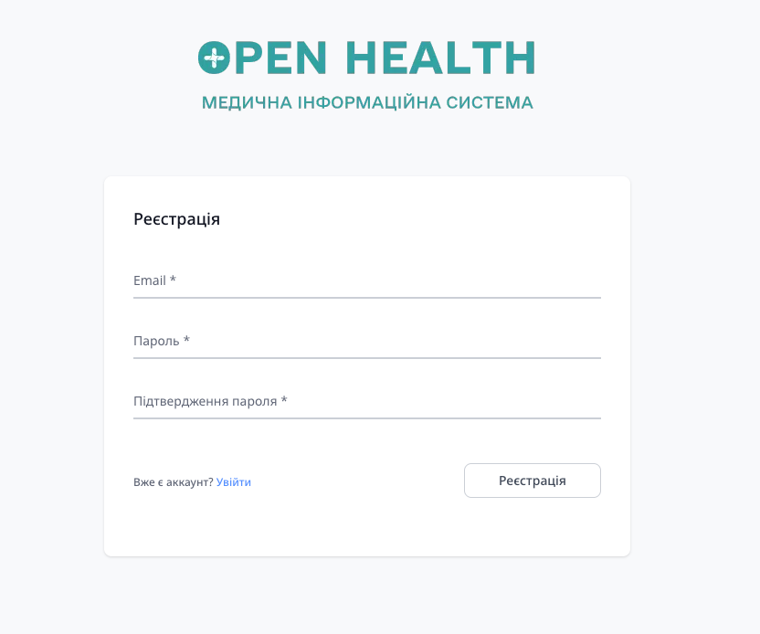
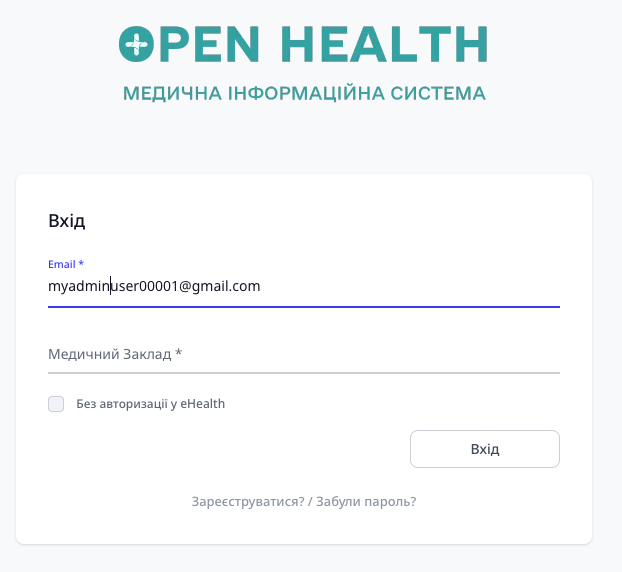
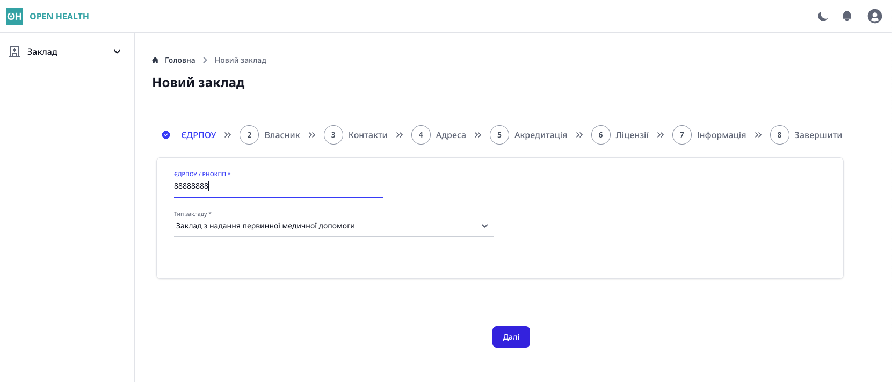
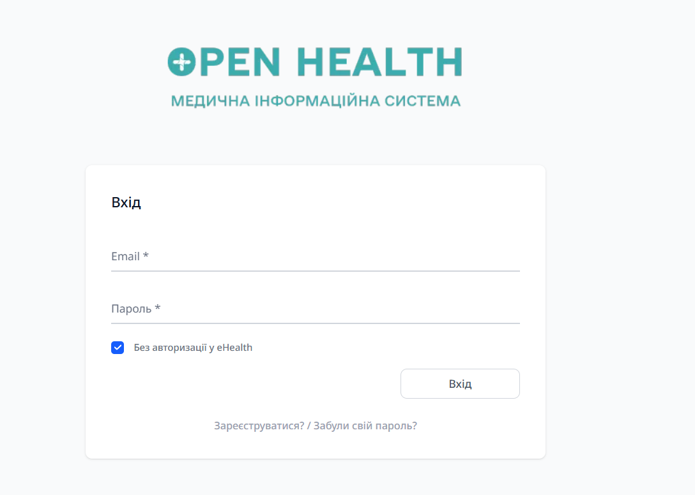
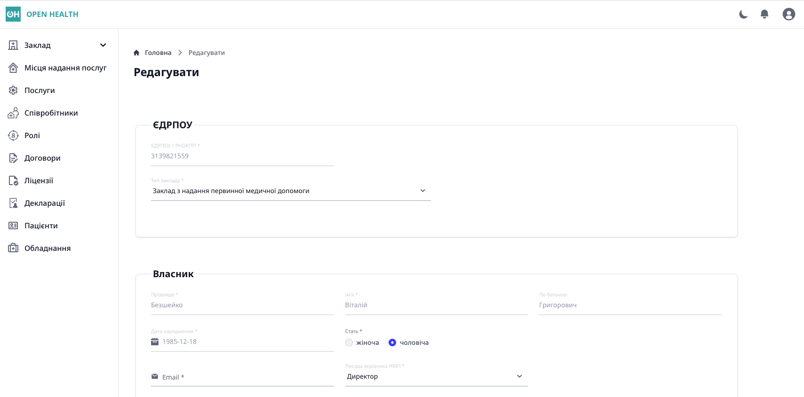

# OHealth
Health Information System (Медична інформаційна система)
## License & copyright
The software is distributed under [GPL version 3](https://www.gnu.org/licenses/gpl-3.0.en.html). Copyright &copy; 2026 Vitalii Bezsheiko
## Requirements
* PHP 8.4+
* PostgreSQL 17.5+
    - Other SQL databases also supported, full list at [Laravel Documentation](https://laravel.com/docs/11.x/database)
* Access to the [eHealth API](https://uaehealthapi.docs.apiary.io/#reference/public.-medical-service-provider-integration-layer/oauth/login?console=1)
* [Composer](https://getcomposer.org), [npm](https://www.npmjs.com), [git](https://git-scm.com)
## Installation for development
### Git
```
git clone https://github.com/Vitaliy-1/openHealth mis-dev
cd mis-dev
git checkout dev
composer install
npm install
npm run build
cp .env.example .env
```
### Environment variables
Before starting the application, see example of the [environment variables configuration](https://github.com/Vitaliy-1/openHealth/blob/main/.env.example).
#### Application
```
APP_NAME=Laravel
APP_ENV=local
APP_KEY=
APP_DEBUG=true
APP_URL=http://localhost
```
General application related variables are defined in this block. `APP_KEY` should be defined only once with `php artisan key:generate`, it's used in data encryption and changing it would lead to inability to decode encrypted data.
#### Database
```
DB_CONNECTION=mysql
DB_HOST=127.0.0.1
DB_PORT=3306
DB_DATABASE=laravel
DB_USERNAME=root
DB_PASSWORD=
```
Database block. We recommend to use PostgreSQL `DB_CONNECTION=pgsql`. MySQL, SQLite, SQL Server, MariaDB are also supported.
#### eHEALTH
```
EHEALTH_API_URL=https://api-preprod.ehealth.gov.ua
EHEALTH_AUTH_HOST=https://auth-preprod.ehealth.gov.ua
EHEALTH_REDIRECT_URI=
EHEALTH_X_CUSTOM_PSK=
EHEALTH_API_KEY=
```
`EHEALTH_API_URL` - URL to the eHealth API environment, `https://api-preprod.ehealth.gov.ua` is URL to the preproduction instance.

`EHEALTH_AUTH_HOST` - URL to the eHealth authentication API

`EHEALTH_REDIRECT_URI` - URL to the application endpoint, which handles user authentication. It receives authentication code from eHealth, which later is exchanged to the token. Contact eHealth to provide the redirect URL of the application.

`EHEALTH_X_CUSTOM_PSK` and `EHEALTH_API_KEY` - are provided by the eHealth and are used in the authentication process. For more details see eHealth [API documentation](https://uaehealthapi.docs.apiary.io/#reference/public.-medical-service-provider-integration-layer/oauth/login).
#### Other
```
CIPHER_API_URL=
```
Application supports qualified digital signatures and uses [Cipher](https://caas.cipher.com.ua) as a service provider. See, Cipher [cryptographic API documentation](https://docs.cipher.com.ua/display/CCSUOS)
## Deployment
```
php artisan first-run
```
This command:
* generates unique application API key (see API_KEY global variable),
* creates tables
* populates tables with data, such as roles and permissions

## What next?

First, start a development server:
```
php artisan serve --host=localhost
```
Successful start of the server will output something like:
```
 INFO  Server running on [http://localhost:8000].  

 Press Ctrl+C to stop the server
```
By default, the application doesn't have any registered legal entities (medical service providers).
To create the first legal entity, register a user with email and password on the registration page. Go to the registration page available at:
```
http://localhost:8000/register
```
The following page should appear:



The next step is to fill the form and submit it. After that, on the specified email address, a confirmation email will be sent. Follow the link in the email to confirm the email address.
Note, that the mailer credentials should be configured properly in the `.env` file to enable email sending. E.g., if using [Mailtrap](https://mailtrap.io/) for development, the configuration may look like this:
```
MMAIL_MAILER=smtp
MAIL_HOST=sandbox.smtp.mailtrap.io
MAIL_PORT=2525
MAIL_USERNAME=at4a7769bcbfdf
MAIL_PASSWORD=********ff45
MAIL_ENCRYPTION=null
MAIL_FROM_ADDRESS="hello@example.com"
MAIL_FROM_NAME="${APP_NAME}"
```
Also, for local usage, [Sendria](https://pypi.org/project/sendria/) could be a great option for the mailer.

After following a link specified in the email, the user should be redirected to the login page (and the record in the column `email_verified_at` in the user table should change accordingly). The login page has the following URL:
```
http://localhost:8000/login
```


To register the first legal entity, check the box "Без авторизації у eHealth" ("Without eHealth authorization").
Then, enter credentials. If all is configured properly, after login, the user should be redirected to the dashboard page with the only option to register a legal entity:



There are several steps to register a legal entity, after filling all the data, the last step is to use a Qualified Digital Signature (QDS) to sign the data for eHealth.
Please use the valid QDS certificate of the legal entity or private entrepreneur, otherwise, the application and eHealth will reject the request.
When the registration is successful, which should be visible by the message on the screen, the user should log out. Before moving further, we recommend to configure asynchronous queues for synchronization of data with eHealth.

## Queues
### Command line
To start the queue worker, run the following command:
```
php artisan queue:work --queue=default,sync
```
After code changes, to apply them to the queue worker, restart it with:
```
php artisan queue:restart
```
See more details about queues in the [Laravel documentation](https://laravel.com/docs/12.x/queues#running-the-queue-worker).
### Supervisor
Another approach, which suits production environments better, is to use [Supervisor](http://supervisord.org/). Here is an example configuration file for Supervisor:
```
[program:oh]
process_name=%(program_name)s_%(process_num)02d
command=/opt/homebrew/bin/php /Users/myuser/mis/artisan queue:work --queue=default,sync --sleep=3 --tries=3 --max-time=3600
autostart=true
autorestart=true
stopasgroup=true
killasgroup=true
user=vitalii
numprocs=8
redirect_stderr=true
stdout_logfile=/Users/myuser/mis/storage/logs/worker.log
stopwaitsecs=3600
```
## Login Methods
After the initial setup and legal entity registration, you can access the application using one of the following methods:

### 1. Standard Login (via eHealth)
This is the official authentication flow used for production-like environments and integration testing.

1. Navigate to the login page: http://localhost:8000/login.
2. Ensure the checkbox "Без авторизації у eHealth" is unchecked.
 
3. Select the registered legal entity in the corresponding field.
4. Click the login button. You will be redirected to the eHealth authentication page.

5. Enter your credentials on the eHealth gateway.
6. After successful authentication, you will be redirected back to the dashboard.

### 2. Developer Login (via eHealth)
A specialized entry point for developers that follows the eHealth authentication flow but is optimized for local development and debugging.


- URL: http://localhost:8000/dev/login

### 3. Local Login
This method is intended for local development to bypass external eHealth authentication.



1. Navigate to the login page: http://localhost:8000/login.
2. Check the box "Без авторизації у eHealth".
3. Enter your local email and password.

> **Current Status:** This feature is in testing mode and is currently non-functional.
> The development of algorithms for full offline operation (without eHealth connectivity) is still in progress. Please use eHealth-based login methods for now.

After successful authentication, the user is automatically redirected to the application dashboard.



> **Note:** For eHealth login to work properly, the `EHEALTH_REDIRECT_URI` in your `.env` must point to a real, accessible URL of your application. For local development, you may set `EHEALTH_CALLBACK_PROD=true` and configure `EHEALTH_URL_DEV` to `http://localhost:8000`.
## Code Style
- view file names: kebab-case
- lang key: snake_case
